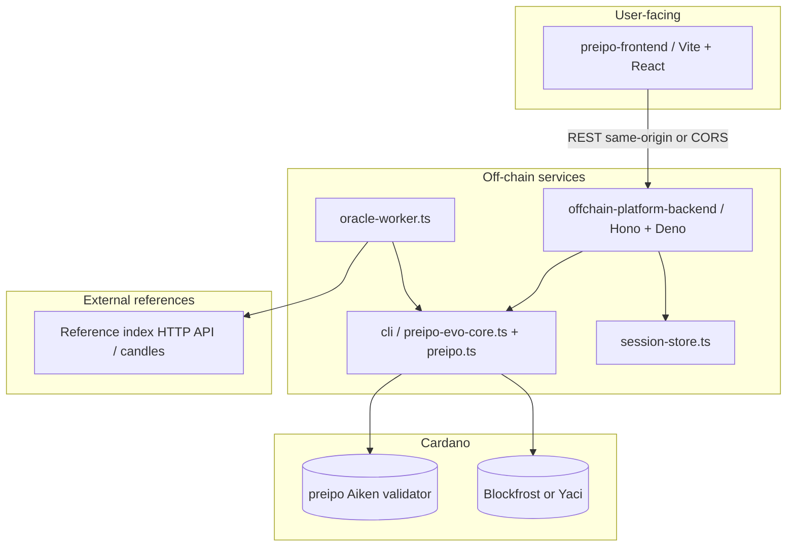
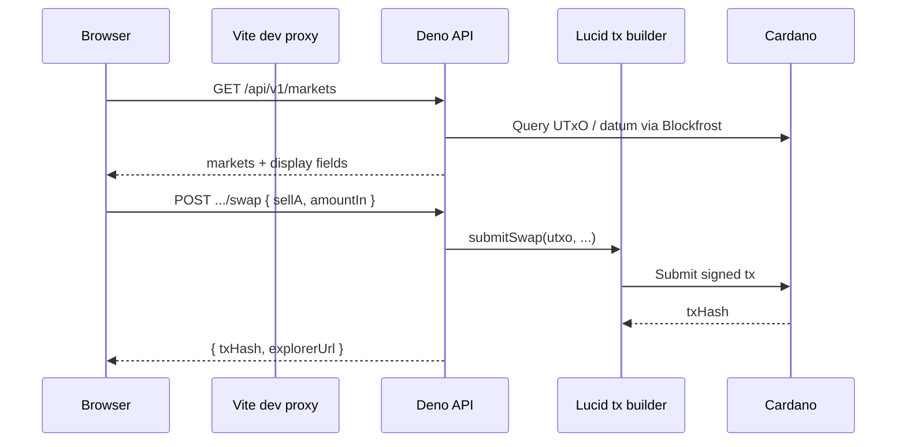
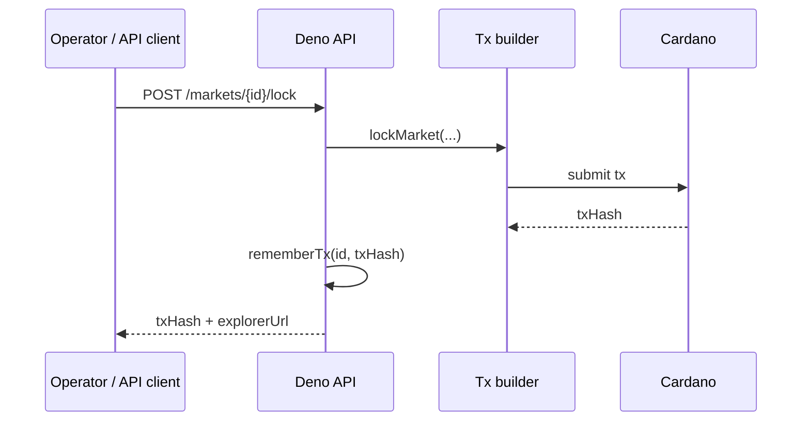

# Pre-IPO Perps — MVP Technical Documentation

**Repository:** `pre-ipo-perps`  
**Purpose:** Minimum viable marketplace stack for synthetic valuation-index exposure on Cardano: Aiken validator, off-chain transaction service (Deno), minimal React UI, and optional reference-index charts.  
**Normative spec (machine-readable API):** `offchain-platform-backend/openapi.json` (served at `/openapi.json` when the backend runs).

---

## 1. Executive summary

The MVP wires three named markets (Anthropic, OpenAI, SpaceX) to a **single Aiken spend validator** (`preipo`) that enforces **oracle updates** (with TWAV and bounded variance), **mint/redeem** of valuation-linked supply against **USDCx-denominated collateral accounting in the datum** (fixed μ-scale `1e6`), and **pool swaps** between reserve legs with an oracle-bounded deviation check. For mint/redeem, the validator requires **preserved native value** on the script UTxO (`in_value == out_value`); **actual USDCx debits/credits** for the operator wallet are applied in the **off-chain USDCx faucet ledger** so the UI can quote deposits and withdrawals consistently. A **Deno HTTP API** wraps the Lucid Evolution builder in `cli/preipo-evo-core.ts`, persists **last spend transaction hashes** per market for chaining, exposes **`GET /api/v1/account`** and **`POST /api/v1/faucet/usdcx`**, and optionally runs an **oracle worker** that maps external reference closes into stepped on-chain price updates. A **Vite + React** dashboard calls the API, shows **USDCx**-labeled balances and quotes, displays reference charts via a **server-proxied candle** endpoint, and surfaces a **Trade history** table driven by the embedded **Preprod report CSV** (with per-tx datum snapshots).

This document describes **architecture**, **workflows**, **dependencies**, **integration/deployment**, **testing** (including the **extended Preprod CSV** as implementation evidence), and **MVP readiness** criteria.

---

## 2. System architecture

### 2.1 High-level diagram



### 2.2 Data plane (simplified)



---

## 3. Module breakdown

| Module | Path | Responsibility |
|--------|------|----------------|
| **Aiken validator** | `validators/preipo.ak` | `Oracle`, `Mint`, `Redeem`, `Swap` redeemers; `MarketState` datum (price, TWAV, reserves, supply, collateral, seq). |
| **Compiled blueprint** | `plutus.json` | Build output consumed by off-chain code. |
| **Tx builder / chain IO** | `cli/preipo-evo-core.ts`, `cli/cardano-env.ts` | Lucid evolution, datum/redeemer encoding, submit lock/oracle/swap/mint/redeem. |
| **CLI entry** | `cli/preipo.ts` | Operator commands for manual flows. |
| **HTTP API** | `offchain-platform-backend/src/app.ts` | REST: health, meta, markets, lock/oracle/swap/mint/redeem, reference candles. |
| **HL / candle client** | `offchain-platform-backend/src/hl-client.ts` | Server-side `candleSnapshot` with retries; used by markets handler + reference candles + oracle worker. |
| **Oracle worker** | `offchain-platform-backend/src/oracle-worker.ts` | Polls reference close; ratio + clamp to `max_variance_bps`; submits oracle txs. |
| **Session store** | `offchain-platform-backend/src/session-store.ts` | Persists `marketId → lastSpendTx` for API chaining. |
| **USDCx faucet** | `offchain-platform-backend/src/usdcx-faucet.ts` | JSON-backed per-address ledger; mint debits / redeem credits in μ-USDCx. |
| **Price / display** | `offchain-platform-backend/src/price-display.ts` | `current_price` → USDCx display helpers. |
| **Emulator bootstrap** | `offchain-platform-backend/src/emulator-bootstrap.ts` | Seeds emulator markets (USDCx-priced reserves) when `PREIPO_USE_EMULATOR=1`. |
| **Market config** | `offchain-platform-backend/src/markets-config.ts` | Static list: `id`, `label`, `hlCoin`, `bootstrapTipTx`. |
| **Preprod batch CLI** | `cli/preprod-three-markets-report.ts` | Preprod: lock → oracle → mint → swap → redeem ×3 markets; writes CSV + optional `docs/preprod-run-*.csv`. |
| **Frontend** | `preipo-frontend/src/*` | `TraderDashboard`, charts, **Trade history** (`PreprodLedger.tsx`), USDCx labels, `api.ts` client. |
| **Preprod evidence CSV** | `preipo-frontend/src/data/preprodLedger.ts` | `PREPROD_LEDGER_CSV`: extended columns (`explorerUrl`, datum snapshot, swap leg, note) + parsers. |

---

## 4. On-chain design (MVP)

Normative source: **`validators/preipo.ak`**. This section summarizes **what is physically on-chain**, how **“USDCx”** appears (and does not appear), the **datum**, and **redeemers**.

### 4.1 What sits on the script UTxO

Each open market is represented by **one** spendable UTxO locked at the `preipo` validator. That UTxO has:

| Part | MVP contents |
|------|----------------|
| **`value` (native assets)** | In current Lucid flows, **lovelace (ADA)** paid to the script. There is **no** separate Cardano **native “USDCx” token** in `value` for this design. The validator requires **`in_value == out_value`** between the spent script input and the single continuing script output: whatever native assets sit on the UTxO must be **preserved** across oracle, mint, redeem, and swap. |
| **Inline datum** | **`PerpDatum`** (see §4.3). All **notional USDCx economics** (prices, collateral accounting, pool reserves, synthetic supply) are stored here as **integers** with a fixed μ-scale (§4.2). |

### 4.2 How “USDCx” is represented on-chain

**On-chain, USDCx is not a minted or synthetic Cardano asset in this MVP.** The Aiken comment *“USDCx vault accounting”* means:

- Integers in **`MarketState`** use **`scale = 1_000_000`** (μ-units), shared with off-chain code (`cli/preipo-evo-core.ts`).
- **`collateral_locked`**, **`current_price`**, **`twav_price`**, **`reserve_a`**, **`reserve_b`**, and **`vtoken_supply`** are **plain `Int` fields in the datum**, interpreted by the product as **μ-USDCx** (or μ-units in the same scale) for display (**1 USDCx ≈ 1 USD** in copy only).
- **Mint/redeem** enforce **vault math** only in those integers (e.g. collateral change from TWAV and minted/burned quantity). They **do not** require a USDCx native token to move in `value`.

The **HTTP USDCx faucet** (`offchain-platform-backend/src/usdcx-faucet.ts`) is a **separate JSON ledger** keyed by Cardano address. It **mirrors** deposit/withdraw semantics for the operator UI: **`debitUsdcx`** after a successful mint, **`creditUsdcx`** after redeem. Auditors should treat **datum** as authoritative for on-chain rules; the faucet as **off-chain demo plumbing**.

### 4.3 Datum types (`PerpDatum` and `MarketState`)

**`PerpDatum`** (inline datum on the script UTxO):

| Field | Type | Role |
|--------|------|------|
| `trader` | `PubKeyHash` | Trader credential; must sign **mint**, **redeem**, and **swap**. |
| `operator` | `PubKeyHash` | Operator credential (distinct role in datum; oracle signing uses `publisher_keyset_hash` inside `MarketState`). |
| `market` | `Option<MarketState>` | `Some(state)` while the market is active; all redeemers in the MVP expect `Some`. |

**`MarketState`** (when `market = Some(...)`):

| Field | Role |
|--------|------|
| `index_id` | Byte string identifying the index (off-chain uses UTF-8 name as hex, e.g. market id). |
| `current_price` | Last oracle price; **μ-scaled** integer. |
| `twav_price` | TWAV used for mint/redeem collateral; **μ-scaled**. |
| `publisher_keyset_hash` | Oracle publisher key hash; must be in `extra_signatories` for **Oracle**. |
| `last_oracle_time` | Milliseconds timestamp (off-chain supplies wall clock); enforces **`min_interval_ms`** after the first oracle step. |
| `collateral_locked` | **Not lovelace** — integer **vault collateral** in μ-units (same scale). |
| `vtoken_supply` | Outstanding synthetic supply (integer μ-units in this MVP). |
| `reserve_a`, `reserve_b` | Constant-product pool legs (μ-units). |
| `seq` | Monotonic counter; must increase by **1** on every successful redeemer. |

### 4.4 Redeemers (`PerpRedeemer`) and Plutus encoding

The validator branches on **`PerpRedeemer`**. Each variant carries enough data to check the transition **from input datum’s `old` state** to the **proposed `new` state**. The continuing output must attach inline datum with **`Some(new)`** and the same `trader` / `operator`.

| Redeemer (Aiken) | Plutus constructor (off-chain `Constr`) | Payload |
|------------------|----------------------------------------|---------|
| `Oracle(new)` | **0**, `[new_market_state]` | Full next `MarketState`. |
| `Mint(new)` | **1**, `[new_market_state]` | Full next `MarketState`. |
| `Redeem(new)` | **2**, `[new_market_state]` | Full next `MarketState`. |
| `Swap(sell_a, amount_in, min_out, new)` | **3**, `[sell_a, amount_in, min_out, new_market_state]` | `sell_a`: 1 = sell A for B, 0 = sell B for A. |

Reference encoding: `cli/preipo-evo-core.ts` (`oracleRedeemer`, `mintRedeemerPlutus`, `redeemRedeemerPlutus`, `swapRedeemer`).

### 4.5 Transition rules (summary)

| Redeemer | Who signs | Main constraints |
|----------|-----------|------------------|
| **Oracle** | `publisher_keyset_hash` | `seq` +1; bounded price move (`max_variance_bps`); TWAV update; **`collateral_locked`**, **`vtoken_supply`**, **`reserve_a`**, **`reserve_b`** unchanged; **`in_value == out_value`**. |
| **Mint** | `trader` | `minted = new.vtoken_supply - old > 0`; `new.collateral_locked = old.collateral_locked + minted * old.twav_price / scale`; pool and price fields unchanged; **`in_value == out_value`**. |
| **Redeem** | `trader` | `burned = old.vtoken_supply - new > 0`; `payout = burned * old.twav_price / scale`; `new.collateral_locked = old.collateral_locked - payout`; pool and price fields unchanged; **`in_value == out_value`**. |
| **Swap** | `trader` | Constant-product on reserves; **`collateral_locked`** and **`vtoken_supply`** unchanged; implied pool price within **`pool_deviation_bps`** of **`twav_price`**; **`in_value == out_value`**. |

Constants (validator): `scale = 1_000_000`, `max_variance_bps = 2000`, `min_interval_ms`, `pool_deviation_bps`, TWAV `9/10` blend after first oracle.

### 4.6 Relation to off-chain API

- **On-chain truth** for vault and pool state is **only** the **inline datum** (and preserved **`value`**).
- **`POST /api/v1/faucet/usdcx`** and **`GET /api/v1/account`** read/write the **faucet file**, not Cardano token balances.
- After **`POST .../mint`** and **`POST .../redeem`**, the API updates the faucet so UI balances stay consistent with datum economics.

---

## 5. Off-chain API (summary)

**Authoritative paths and schemas:** `offchain-platform-backend/openapi.json`.  
**Interactive docs:** `GET /docs` when the server is running.

### 5.1 Core endpoints (non-exhaustive)

| Method | Path | Role |
|--------|------|------|
| `GET` | `/health` | Liveness. |
| `GET` | `/api/v1/meta` | Script / network hints (`preprod`, `emulator`). |
| `GET` | `/api/v1/account` | Operator wallet address, lovelace, **USDCx faucet balance** (μ-units + display). |
| `POST` | `/api/v1/faucet/usdcx` | Credit USDCx faucet ledger for the operator address (demo liquidity). |
| `GET` | `/api/v1/markets` | Alias aggregated markets view (same as ventuals path). |
| `GET` | `/api/v1/ventuals/markets` | Per-market chain datum + reference close + **USDCx display** fields. |
| `POST` | `/api/v1/reference-candles` | Body: `{ interval, startTime, endTime }` → `{ series: { anthropic, openai, spacex: candles[] } }` (server-side staggered fetch). |
| `POST` | `/api/v1/markets/:marketId/lock` | Initial lock UTxO. |
| `POST` | `/api/v1/markets/:marketId/oracle` | Oracle update (`newPrice` or `bumpBps`). |
| `POST` | `/api/v1/markets/:marketId/swap` | Pool swap. |
| `POST` | `/api/v1/markets/:marketId/mint` | Mint vToken supply (per contract rules). |
| `POST` | `/api/v1/markets/:marketId/redeem` | Burn / redeem path. |
| `GET` | `/api/v1/markets/:marketId/state?spendTx=` | Read datum from a given spend tx. |

### 5.2 Example request / response (swap)

**Request**

```http
POST /api/v1/markets/anthropic/swap HTTP/1.1
Content-Type: application/json

{"sellA":1,"amountIn":"8000"}
```

**Response (shape)**

```json
{
  "txHash": "<64-char hex>",
  "explorerUrl": "https://preprod.cardanoscan.io/transaction/<txHash>",
  "marketId": "anthropic"
}
```

---

## 6. Frontend (`preipo-frontend`)

- **Stack:** React 19, Vite 6, TypeScript.
- **API client:** `src/api.ts` — `apiBase()` uses **same-origin** in dev (Vite proxy) unless `VITE_DEV_BACKEND` is set for direct-to-Deno calls.
- **Screens:** Market cards (**USDCx**-labeled prices, reserves, quotes), swap / mint / redeem actions, reference charts (`postReferenceCandles`), session **activity log**, **Trade history** (`PreprodLedger.tsx`) with step/datum snapshot/swap-leg columns + collapsible **raw CSV** from `preprodLedger.ts`.

**Dev (recommended):**

```bash
cd offchain-platform-backend && deno task serve:emulator
cd preipo-frontend && npm run dev
```

Open the URL Vite prints (e.g. `http://localhost:5173`). Ensure `/api` proxies to the backend (`vite.config.ts` uses `VITE_DEV_BACKEND` or defaults to `http://127.0.0.1:8787` for the **proxy target only**).

**Production build:**

```bash
cd preipo-frontend && npm run build
```

Serve `dist/` behind a reverse proxy that forwards `/api` (and `/health` if needed) to the Deno service, or set `VITE_API_BASE` at build time to the public API origin.

---

## 7. Workflows (end-to-end)

### 7.1 Lock → chain tip



### 7.2 Automated oracle (worker)

1. Worker loads last reference close per `hlCoin` (candles).
2. Compares to previous sample; computes ratio target from on-chain `current_price`.
3. Clamps delta to on-chain `max_variance_bps` (2000 bps in worker, matching validator intent).
4. If changed, `submitOracle` and `rememberTx`.

Environment: `PREIPO_ORACLE_WORKER=0` disables the loop. See `main.ts` header comments for `HL_ORACLE_INTERVAL`, `ORACLE_POLL_MS`, `ORACLE_TX_GAP_MS`, `HL_INFO_URL`.

### 7.3 User trading (UI → API)

1. UI `GET /api/v1/markets` and `GET /api/v1/account` for datum, reference pricing, and **USDCx faucet** balance.
2. User tops up demo balance via `POST /api/v1/faucet/usdcx` when needed.
3. User submits swap/mint/redeem → `POST` with string bigints for amounts.
4. API resolves UTxO from **session** `lastSpendTx` unless overridden (per OpenAPI / implementation).
5. On success, session updated so the next operation chains from the new tip; mint/redeem adjust the **faucet ledger** to match datum economics.

### 7.4 Reference charts

1. UI `POST /api/v1/reference-candles` with `interval` + `startTime` + `endTime`.
2. Backend fetches three markets **sequentially** with backoff on 429.
3. UI renders closes as line charts.

---

## 8. Dependencies (MVP readiness)

| Dependency | Used by | Notes |
|------------|---------|--------|
| **Deno** | Backend, CLI scripts | `deno task` in `offchain-platform-backend/deno.json`. |
| **Node.js / npm** | Frontend | Vite build. |
| **Aiken** | `validators/preipo.ak` | Compile to `plutus.json`. |
| **Blockfrost or Mesh Yaci** | `cli/cardano-env.ts` | Preprod vs emulator networking. |
| **Funded wallet seed** | Preprod signing | `PREIPO_WALLET_SEED` (and related Lucid env) for real submission. |
| **USDCx faucet file** | `usdcx-faucet.ts` | JSON ledger path `PREIPO_USDCX_FAUCET_PATH` (default under `/tmp/`). |
| **Reference HTTP API** | `hl-client.ts` | Candle snapshot URL overridable via `HL_INFO_URL`. |

---

## 9. Integration & deployment guidelines

### 9.1 Environment matrix

| Mode | Flag | Chain access | Typical use |
|------|------|--------------|-------------|
| **Emulator** | `PREIPO_USE_EMULATOR=1` | In-process / Yaci-style per `cardano-env.ts` | Fast local demos, CI-style smoke tests. |
| **Preprod** | `PREIPO_USE_PREPROD=1` | Blockfrost Preprod | Public testnet validation. |

### 9.2 Backend tasks

```bash
cd offchain-platform-backend
deno task serve:emulator   # PREIPO_USE_EMULATOR=1
deno task serve:preprod    # PREIPO_USE_PREPROD=1
deno task test             # integration-test.ts (see §10.2)
```

From the **repository root**, full Preprod evidence export (lock → oracle → mint → swap → redeem for all three markets):

```bash
PREIPO_USE_PREPROD=1 deno run -A cli/preprod-three-markets-report.ts
```

See §10.1 for CSV columns and how the UI embeds the same string.

### 9.3 Important environment variables

| Variable | Purpose |
|----------|---------|
| `PORT` | API port (default `8787`). |
| `PREIPO_USE_EMULATOR` / `PREIPO_USE_PREPROD` | Chain mode (mutually exclusive in normal use). |
| `PREIPO_ORACLE_WORKER` | Set `0` to disable background oracle. |
| `HL_ORACLE_INTERVAL` | `15m` / `1h` / `4h` / `1d`. |
| `HL_INFO_URL` | Override candle POST endpoint. |
| `PREIPO_SESSIONS_PATH` | Optional JSON session file location. |
| `PREIPO_MARKET_TIPS` | Bootstrap tips `market:tx,...` when sessions empty. |
| `BLOCKFROST_URL`, `BLOCKFROST_PROJECT_ID` | Preprod queries. |
| `PREIPO_WALLET_SEED` | Signing on Preprod (keep secret). |
| `PREIPO_USDCX_FAUCET_PATH` | Optional path to JSON backing the USDCx faucet ledger (default under `/tmp/`). |
| `PREIPO_REPORT_CSV` | Optional output path for `cli/preprod-three-markets-report.ts` (else timestamped file under `docs/`). |

### 9.4 Release process (suggested)

1. **Contracts:** `aiken build`, verify `plutus.json` committed or reproduced in CI.
2. **Backend:** `deno check` on `main.ts` and `src/*.ts`; run `deno task test` (emulator).
3. **Frontend:** `npm run build`, serve `dist/` with API proxy or `VITE_API_BASE`.
4. **Smoke:** `GET /health`, `GET /api/v1/meta`, one successful `POST` on emulator.

### 9.5 PDF export with rendered Mermaid diagrams

The file `docs/render-pdf.ts` builds **`docs/MVP-TECHNICAL-DOCUMENTATION.pdf`** from this Markdown. Architecture **Mermaid** blocks in the doc are converted to SVG in **headless Chrome** using **Mermaid 10** loaded from **jsDelivr** (no local Mermaid install required).

#### Prerequisites (install once)

| Tool | Role |
|------|------|
| **Deno** | Runs `render-pdf.ts` (`npm:` marked + puppeteer). |
| **Node.js + npx** | Installs the Chrome binary Puppeteer uses for printing. |
| **Network** | Headless Chrome fetches `mermaid.min.js` from the CDN on each run. |

Install Chrome for Puppeteer (downloads to `~/.cache/puppeteer/chrome/`):

```bash
npx puppeteer browsers install chrome
```

Optional: set **`PUPPETEER_EXECUTABLE_PATH`** to a system Chrome/Chromium if you do not use the cache layout above.

#### Command

From the **repository root** (`pre-ipo-perps/`):

```bash
deno run -A docs/render-pdf.ts
```

Output: **`docs/MVP-TECHNICAL-DOCUMENTATION.pdf`** (A4, print background). Re-run after editing this `.md` file.

---

## 10. Testing approach, success criteria, and evidence

### 10.1 Preprod CSV ledger (primary implementation evidence)

The file `preipo-frontend/src/data/preprodLedger.ts` embeds **`PREPROD_LEDGER_CSV`**: a frozen export produced by **`cli/preprod-three-markets-report.ts`** on Preprod, with **three markets** and **15 transactions** total:

- Per market: **1× `lock`**, **1× `oracle_1`**, **1× `mint`**, **1× `swap_1`**, **1× `redeem`** (full vertical slice including vault + pool).
- Columns: `market`, `step`, `txHash`, `explorerUrl`, datum snapshot fields (`current_price`, `twav_price`, `collateral_locked`, `vtoken_supply`, `reserve_a`, `reserve_b`, `seq`), optional pool leg (`sellA`, `amountIn`), and `note`.

The CLI can also write a copy to **`docs/preprod-run-<timestamp>.csv`** (`PREIPO_REPORT_CSV` overrides the path). Re-run the script after contract or flow changes, then paste the CSV into `PREPROD_LEDGER_CSV` if you want the UI and this appendix to stay identical.

**How this is used as testing documentation**

1. **Traceability:** Every hash is independently verifiable on Preprod Cardanoscan (`explorerUrl` column).
2. **Regression / audit trail:** The CSV is the **golden log** of “the script accepted this sequence” for **oracle, mint, swap, and redeem** on one campaign.
3. **UI attachment:** The same data is rendered under **Trade history** (per-market tables, datum snapshot column, raw CSV block).

**Interpretation of `step` labels**

| Step prefix / value | Meaning |
|---------------------|---------|
| `lock` | Initial market UTxO / bootstrap establishing the chain tip for that market. |
| `oracle_N` | N-th oracle update (bounded variance + TWAV on-chain). |
| `mint` | Mint vToken supply; datum `collateral_locked` increases per TWAV. |
| `swap_N` | N-th pool swap (`sellA`, `amountIn` populated in CSV). |
| `redeem` | Burn vToken; datum collateral reduced per TWAV. |

**Older export:** A historical **63-row** campaign (10× oracle + 10× swap per market, no mint/redeem in that file) may still appear in git history; the **current** canonical evidence is the **extended 15-row** export above.

### 10.2 Automated API integration test

**Script:** `offchain-platform-backend/scripts/integration-test.ts`  
**Task:** `deno task test` from `offchain-platform-backend`.

**Behaviour**

- Unless `BACKEND_URL` is set, spawns `main.ts` on `TEST_PORT` (default `9876`) with emulator or Preprod flags.
- Waits for `/health`.
- Executes: **1× lock**, **3× oracle** (`bumpBps: 10100`), **3× swap** (`sellA: 1`, `amountIn: "8000"`).
- Asserts each response includes a **64-character** `txHash`.
- Logs lines such as `oracle_1`, `swap_2` to stdout — treat these as **machine-generated test logs** for CI artifacts.

**Success criteria (automated)**

- Process exits **0**.
- Console ends with: `All 1 + 3 + 3 transactions returned tx hashes OK.`

**Preprod variant:** Set `PREIPO_USE_PREPROD=1` when running the script; allow longer health wait and delays between txs (script includes sleeps and retries).

**Broader Preprod campaign:** For a frozen ledger that includes **mint** and **redeem** on Preprod, use **`cli/preprod-three-markets-report.ts`** (§9.2, §10.1) instead of relying on this integration script alone.

### 10.3 Manual validation checklist (MVP)

| # | Check | Pass criterion |
|---|--------|----------------|
| 1 | Backend health | `GET /health` → `{ "ok": true }`. |
| 2 | Markets | `GET /api/v1/markets` → 200, three known `id`s. |
| 3 | Reference candles | `POST /api/v1/reference-candles` → 200, non-empty `series` for each market over a 7d window (subject to upstream availability). |
| 4 | UI | Load dashboard; API pill “live”; charts render without persistent error banner. |
| 5 | Preprod evidence | Spot-check **≥3** random CSV rows on Cardanoscan; datum/redeemer match expected action. |
| 6 | USDCx faucet | `POST /api/v1/faucet/usdcx` → 200; `GET /api/v1/account` shows updated `usdcxBalance` (emulator or preprod backend). |

### 10.4 Technical dependencies for “MVP ready”

- Emulator path works **without** funded Preprod wallet.
- Preprod path requires **working Blockfrost**, **correct `plutus.json` / address**, and **funded operator wallet**.
- Reference feed available or graceful degradation (charts empty, oracle logs warnings).

---

## 11. Replication notes (auditors / reviewers)

1. Clone the repository and run **Aiken build** if you need to regenerate `plutus.json`.
2. Start backend (`serve:emulator` or `serve:preprod`).
3. Run `deno task test` for a short automated trail, or replay flows via OpenAPI `/docs`.
4. For historical proof, open any `explorerUrl` from **Appendix A** in a browser and compare transaction metadata to `validators/preipo.ak` constraints.

---

## Appendix A — Preprod validation ledger (full CSV export)

The following CSV is **identical** to the string embedded in `preipo-frontend/src/data/preprodLedger.ts` (`PREPROD_LEDGER_CSV`). It is the **attached test log / evidence** for the Preprod demonstration run described in §10.1 (extended columns: explorer link, datum snapshot, optional swap leg, note).

```csv
market,step,txHash,explorerUrl,current_price,twav_price,collateral_locked,vtoken_supply,reserve_a,reserve_b,seq,sellA,amountIn,note
anthropic,lock,b15cd6d048304c9ade05fe36bb82c5d6279da9de0d4b66b6ffadd701d0657b34,https://preprod.cardanoscan.io/transaction/b15cd6d048304c9ade05fe36bb82c5d6279da9de0d4b66b6ffadd701d0657b34,1000000,1000000,0,0,10000000,10000000,0,,,initial
anthropic,oracle_1,a4e80d92dd3cbcd228e996bd027d122f8a5bf7bc6cff52d976958d6236073cb2,https://preprod.cardanoscan.io/transaction/a4e80d92dd3cbcd228e996bd027d122f8a5bf7bc6cff52d976958d6236073cb2,1010000,1010000,0,0,10000000,10000000,1,,,bump +1%
anthropic,mint,2c6034e8cdcab97d2bace4d439c43598039bd12068d287de983d391f8d4894ae,https://preprod.cardanoscan.io/transaction/2c6034e8cdcab97d2bace4d439c43598039bd12068d287de983d391f8d4894ae,1010000,1010000,5050,5000,10000000,10000000,2,,,qty=5000
anthropic,swap_1,0389c0da166602894b09bca762ca9fc20df9aece0124a28ab7c9712ae23be4df,https://preprod.cardanoscan.io/transaction/0389c0da166602894b09bca762ca9fc20df9aece0124a28ab7c9712ae23be4df,1010000,1010000,5050,5000,10008000,9992007,3,1,8000,pool trade
anthropic,redeem,7743d8340c107206afd568e341318615c1ab4740c45e055558e7f460f5707b4e,https://preprod.cardanoscan.io/transaction/7743d8340c107206afd568e341318615c1ab4740c45e055558e7f460f5707b4e,1010000,1010000,3030,3000,10008000,9992007,4,,,burn=2000
openai,lock,5e19c84ee7dd313a7f2c92a9fbf55b7b19eb0e3d0460da22f8acd1460c851692,https://preprod.cardanoscan.io/transaction/5e19c84ee7dd313a7f2c92a9fbf55b7b19eb0e3d0460da22f8acd1460c851692,1000000,1000000,0,0,10000000,10000000,0,,,initial
openai,oracle_1,f81c7037eb5945a645147094f2fccb0c5285044a2fabc7292aea5fb953311418,https://preprod.cardanoscan.io/transaction/f81c7037eb5945a645147094f2fccb0c5285044a2fabc7292aea5fb953311418,1010000,1010000,0,0,10000000,10000000,1,,,bump +1%
openai,mint,e297b02842166871f03507b41585ddb4ed50f43f38429b8383beb4ce4f9adfae,https://preprod.cardanoscan.io/transaction/e297b02842166871f03507b41585ddb4ed50f43f38429b8383beb4ce4f9adfae,1010000,1010000,5050,5000,10000000,10000000,2,,,qty=5000
openai,swap_1,2091531c02a5bcd3fb832f2bc9fe59774c9904369de0bdba4f24b416770c57f1,https://preprod.cardanoscan.io/transaction/2091531c02a5bcd3fb832f2bc9fe59774c9904369de0bdba4f24b416770c57f1,1010000,1010000,5050,5000,10008000,9992007,3,1,8000,pool trade
openai,redeem,adf0696d88c19146a8cc01c6f7a6aa773f356fea5c44d7d94ad940a738332933,https://preprod.cardanoscan.io/transaction/adf0696d88c19146a8cc01c6f7a6aa773f356fea5c44d7d94ad940a738332933,1010000,1010000,3030,3000,10008000,9992007,4,,,burn=2000
spacex,lock,9c0f3fcec7edb0cc0e5458b790015941a1895fce7abb8b73138b8abcbed39aaa,https://preprod.cardanoscan.io/transaction/9c0f3fcec7edb0cc0e5458b790015941a1895fce7abb8b73138b8abcbed39aaa,1000000,1000000,0,0,10000000,10000000,0,,,initial
spacex,oracle_1,544148d49c7fa3dd9c75a7e3da5608a9274de9461e6399c0ed396665f3a91f0a,https://preprod.cardanoscan.io/transaction/544148d49c7fa3dd9c75a7e3da5608a9274de9461e6399c0ed396665f3a91f0a,1010000,1010000,0,0,10000000,10000000,1,,,bump +1%
spacex,mint,7d274822e6092555f772bf2ae4da6f13d669c6d20598b16b5d7ca64eafb1b088,https://preprod.cardanoscan.io/transaction/7d274822e6092555f772bf2ae4da6f13d669c6d20598b16b5d7ca64eafb1b088,1010000,1010000,5050,5000,10000000,10000000,2,,,qty=5000
spacex,swap_1,9a884a1b9dc350b5c8aaf30a54c4c4b8d29cf8c36670231c000e249c293e8e58,https://preprod.cardanoscan.io/transaction/9a884a1b9dc350b5c8aaf30a54c4c4b8d29cf8c36670231c000e249c293e8e58,1010000,1010000,5050,5000,10008000,9992007,3,1,8000,pool trade
spacex,redeem,5ac137ac0ea90bf6c05a4c7ad111be1ef9c6506bd5dce2eb31276afad51f5b73,https://preprod.cardanoscan.io/transaction/5ac137ac0ea90bf6c05a4c7ad111be1ef9c6506bd5dce2eb31276afad51f5b73,1010000,1010000,3030,3000,10008000,9992007,4,,,burn=2000
```

---

## Appendix B — Example automated test log (integration test)

When `deno task test` succeeds, stdout includes lines similar to:

```text
Waiting for server http://127.0.0.1:9876 (emulator)
marketId api_backend_demo
lock <64-char hex>
oracle_1 <64-char hex>
oracle_2 <64-char hex>
oracle_3 <64-char hex>
swap_1 <64-char hex>
swap_2 <64-char hex>
swap_3 <64-char hex>

All 1 + 3 + 3 transactions returned tx hashes OK.
```

Capture this output in CI as the **test artifact** alongside this document.

---

*End of MVP Technical Documentation*
