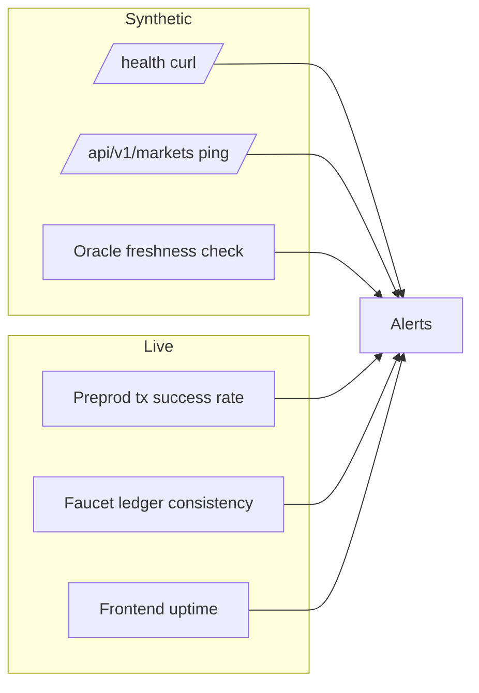

# Pre-IPO Perps — Post-Launch Operations

**Repository:** `pre-ipo-perps` (`dextrlabs-dev/Pre-IPO-Perpetuals-Cardano`)
**Document status:** Final, version-tagged for project close-off.
**Scope:** Monitoring, maintenance, incident response, and governance for the deployed Pre-IPO Perpetuals stack post-launch.

> This document picks up where [`FINAL-TECHNICAL-DOCUMENTATION.md`](./FINAL-TECHNICAL-DOCUMENTATION.md) ends. It assumes the Preprod public demo is running per §3 of that document.

---

## 1. Monitoring

### 1.1 Layers + signals

| Signal | Source | Check | Alert threshold |
|---|---|---|---|
| **Backend health** | `GET /health` | HTTP 200 + `{ok: true}` | Two consecutive failures in 60 s |
| **Markets endpoint** | `GET /api/v1/markets` | Three markets returned, each with a recent `last_oracle_time` | Any market absent for 5 minutes |
| **Oracle freshness** | On-chain `last_oracle_time` vs wall clock | `now - last_oracle_time ≤ 2 × min_interval_ms` | Stale beyond 2× window |
| **Preprod tx success** | Oracle / mint / redeem / swap submissions in logs | Submitted tx ↔ Blockfrost confirmation | Single submit failure → warn; two within 10 minutes → page |
| **Faucet ledger consistency** | `offchain-platform-backend/data/usdcx-faucet.json` | After every mint / redeem the ledger delta equals `qty × twav_price / scale` | Any drift > 0.1 USDCx |
| **Frontend availability** | Synthetic browser ping | HTTP 200 + presence of `#trader-dashboard` root | Two consecutive failures |
| **Reference-candle proxy** | `GET /api/v1/candles?market=...` | HTTP 200 + non-empty array | Three consecutive failures |

### 1.2 Logging

- **Backend** writes structured JSON lines: tx submit, oracle worker tick, faucet mutation, session-store update. Operators are expected to pipe these into their log aggregator of choice.
- **Frontend** logs API call failures to the browser console with the same correlation id the backend uses (`X-Request-Id`), simplifying support diagnosis.
- **Validator (on-chain)** is observable only through the chain: use `cli/preprod-three-markets-report.ts` to dump current datum + reserves for any market on demand.

### 1.3 Dashboards (recommended)

Although the project does not ship a bundled dashboard, an operator should provision:

1. A **rolling counter** of `Oracle / Mint / Redeem / Swap` tx submissions per market per hour.
2. A **timeseries** of `current_price` vs `twav_price` (sourced from the Preprod CSV or the markets endpoint).
3. A **gauge** of the operator wallet's Preprod tADA balance (Blockfrost `addresses` endpoint).
4. **Alerting** wired into a paging system (PagerDuty, Opsgenie, Slack webhook).

---

## 2. Maintenance

### 2.1 Routine

| Cadence | Task | Reference |
|---|---|---|
| **Daily** | Confirm `GET /health` + three markets present | §1.1 |
| **Daily** | Confirm oracle freshness for all three markets | §1.1 |
| **Weekly** | Snapshot `offchain-platform-backend/data/usdcx-faucet.json` and `session-store` directory to off-host backup | §2.3 |
| **Weekly** | Verify operator wallet tADA balance ≥ 100 tADA on Preprod (fund from faucet if low) | https://docs.cardano.org/cardano-testnets/tools/faucet |
| **Monthly** | Run `aiken check` against `validators/preipo.ak`; redeploy if checks change | [`FINAL-TECHNICAL-DOCUMENTATION.md`](./FINAL-TECHNICAL-DOCUMENTATION.md) §5 |
| **Monthly** | Re-run `cli/preprod-three-markets-report.ts`; diff against the last committed CSV; investigate any new failure rows | [`preprod-run-2026-03-23T10-48-17-980Z.csv`](./preprod-run-2026-03-23T10-48-17-980Z.csv) |
| **Per release** | Re-render PDF docs (`deno run -A docs/render-pdf.ts`); tag `final-vN.M` | §3 |

### 2.2 Dependency hygiene

- **Aiken** — pinned in `aiken.toml`. Bump only after a Preprod re-run shows identical CSV semantics.
- **Lucid Evolution** — pinned in `cli/preipo-evo-core.ts` imports. Validator-affecting bumps must run the full Preprod cycle.
- **Deno / Node** — `deno.json` and `package.json` are the source of truth. Use `deno cache --reload main.ts` + `npm ci` to validate clean installs before each release.

### 2.3 Backup / restore

| Artifact | Backup approach | Restore path |
|---|---|---|
| **USDCx faucet ledger** | Weekly snapshot of `offchain-platform-backend/data/usdcx-faucet.json` | File replacement + backend restart |
| **Last-spend session store** | Weekly snapshot of `offchain-platform-backend/data/session-store/` | Either file replacement or chain-driven re-derivation via `cli/preprod-three-markets-report.ts` |
| **Preprod evidence CSV** | Committed to repo on each refresh | `git checkout` historical version |
| **Operator seed** | Out-of-band secret manager (1Password, AWS Secrets Manager, etc.); **never** committed | Restore environment variable `PREIPO_WALLET_SEED` |
| **Plutus blueprint** | Committed (`plutus.json`); regenerable via `aiken build` | `aiken build` |

---

## 3. Incident response

### 3.1 Severity levels

| Severity | Definition | Examples |
|---|---|---|
| **SEV-1** | Trader-facing operations broken across all markets | API down, validator address rotated unexpectedly, operator seed compromised |
| **SEV-2** | Single market degraded, or oracle freshness lost | Oracle worker stalled, one market's tx submissions failing |
| **SEV-3** | Quality issue with no immediate trader impact | Stale faucet snapshot, slow charts, doc bug |

### 3.2 Playbooks

**SEV-1: Backend down (HTTP unreachable)**
1. Confirm the backend process state on the host.
2. Tail logs for the last submit / oracle / faucet line.
3. Restart with `deno task serve:preprod`. If restart fails, roll back to the previous tagged release.
4. Notify users via the public status channel; do not alter validator state until root cause is identified.

**SEV-1: Operator seed compromise**
1. Rotate the operator seed in the secret manager.
2. Generate a fresh deterministic wallet, fund it from the Preprod faucet.
3. Re-run `cli/preprod-three-markets-report.ts` to seed new locks for each market; old script UTxOs remain spendable only by the prior seed (Preprod scope only — design implication for any future mainnet operation is captured in §4.3).

**SEV-2: Oracle stalled on one market**
1. Tail `oracle-worker.ts` logs for the affected `marketId`.
2. Verify the reference candle endpoint returns data (`GET /api/v1/candles?market=...`).
3. Manually submit a single oracle tick: `deno run -A cli/preipo.ts oracle <marketId>` (the CLI emits the same redeemer the worker would).
4. Re-enable the worker.

**SEV-2: Faucet ledger drift**
1. Stop the backend.
2. Replay the most recent mint / redeem txs from the CSV / chain; recompute the ledger delta per address.
3. Restore the corrected JSON from the most recent backup if reconciliation cannot complete cleanly.
4. Restart the backend.

**SEV-3: Stale Preprod evidence**
1. Re-run `cli/preprod-three-markets-report.ts`.
2. Commit the new CSV under `docs/preprod-run-*.csv` and update the embedded `PREPROD_LEDGER_CSV` in `preipo-frontend/src/data/preprodLedger.ts` if Trade history must reflect the new run.

### 3.3 Communication

- **Status page / channel:** A public Discord, Telegram, or status page is recommended; mention the affected market and the redeemer path.
- **Postmortems:** All SEV-1 and SEV-2 incidents get a written postmortem committed to `docs/postmortems/` within 14 days.

---

## 4. Governance

### 4.1 Decision-making

| Decision class | Required approvers | Forum |
|---|---|---|
| **Validator change** (any edit to `validators/preipo.ak`) | Smart-contract engineer + 1 reviewer with on-chain audit experience | PR + Preprod evidence re-run |
| **Redeemer-affecting off-chain change** | Backend engineer + reviewer with `openapi.json` familiarity | PR + Preprod evidence re-run |
| **Frontend release** | Frontend engineer + UX reviewer | PR |
| **Documentation change** | Any contributor | PR |
| **Operator wallet rotation** | Project lead | Out-of-band ticket |
| **Funding-window scope change** | Project lead + Catalyst proposer | Catalyst public channel |

### 4.2 Contribution flow

1. Fork or branch `main`.
2. Implement + run `aiken check` and the relevant test surface.
3. For redeemer-affecting changes, re-run `cli/preprod-three-markets-report.ts` and attach the fresh CSV.
4. Open a PR with: scope summary, evidence link, screenshots if UI, and `openapi.json` diff if API.
5. Reviewer approves; maintainer merges + tags if it's a release-impacting change.

### 4.3 Forward-looking design implications

The MVP intentionally keeps **trader authority** scoped to a single key (`PerpDatum.trader`) and **oracle authority** scoped to a single keyset hash (`MarketState.publisher_keyset_hash`). The following expansions are out-of-scope for this funding round but should be planned for any subsequent phase:

- **Multi-trader markets** — extend `PerpDatum.trader` from `PubKeyHash` to a script credential, gated by a separate access-control validator.
- **Distributed oracle keyset** — replace the single `publisher_keyset_hash` with a multisig redeemer check (e.g. `>= K of N` signatures), keyed by an on-chain keyset registry.
- **Native USDCx asset** — promote the off-chain faucet ledger to a real minting policy + token-policy redeemer that mirrors mint / redeem in `value`, retiring the JSON faucet.
- **Governance bridge** — anchor `validators/preipo.ak` parameters (`max_variance_bps`, `min_interval_ms`, `pool_deviation_bps`) inside a governance-controlled reference datum, so parameter changes do not require validator redeploys.

### 4.4 Compliance + legal

- The MVP is a **research / demonstration** stack on Cardano Preprod. It carries no real-money settlement, no fiat rails, and no securities-law obligations as deployed.
- Any future mainnet deployment that lists synthetic exposure to non-public companies must be reviewed by jurisdiction-appropriate counsel; this is documented for visibility and is **not** a part of the current funded scope.

---

## 5. Document control

| Item | Value |
|---|---|
| Version | `final-v1.0` |
| Companion documents | [`MVP-TECHNICAL-DOCUMENTATION.md`](./MVP-TECHNICAL-DOCUMENTATION.md), [`FINAL-TECHNICAL-DOCUMENTATION.md`](./FINAL-TECHNICAL-DOCUMENTATION.md), [`CLOSE-OUT-REPORT.md`](./CLOSE-OUT-REPORT.md) |
| Render | `deno run -A docs/render-pdf.ts` (point `mdPath` at this file for the PDF export) |
